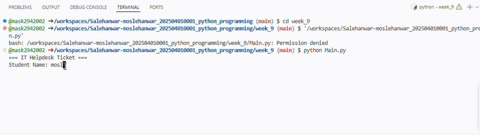

# IT Helpdesk Ticket Registration System

## 1. Purpose of the Application
The IT Helpdesk Ticket Registration System is a modular Python application designed for City University Malaysia. It allows students to report technical issues (such as LMS login problems, Wi-Fi errors, or printer malfunctions) and automatically creates a structured helpdesk ticket while assigning a specific technician based on the priority level.

## 2. Tech Stack
* **Language:** Python 3
* **Version Control:** Git & GitHub

## 3. How to Use
1. Clone the repository and navigate to the `week_9` directory:
   ```bash
   cd week_9
   ```
2. Run the main script using Python:
   ```bash
   python main.py
   ```
3. Enter the requested information (Student Name, ID, Issue, Location, Priority).
4. View the generated ticket summary in the terminal output.

## 4. Demonstration
